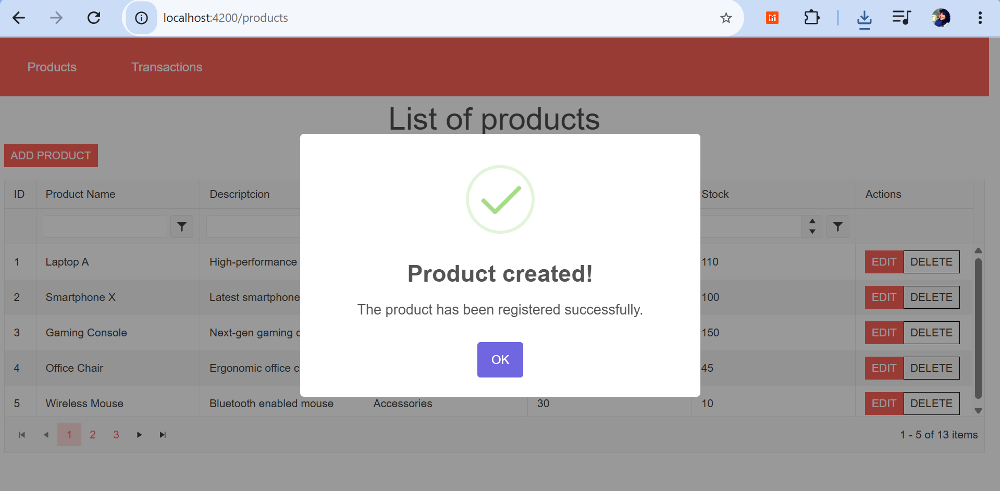

# InventoryApp
## Requisitos
Antes de ejecutar la aplicación asegúrate de tener instalado lo siguiente:

- [.NET 7 SDK](https://dotnet.microsoft.com/download)
- [Node.js](https://nodejs.org/) (v18 o superior recomendado)
- [Docker](https://www.docker.com/) y Docker Compose
- Angular CLI:  npm install -g @angular/cli
# Ejecución de la aplicación
 -- clona el proyecto en una carpeta de tu PC
 -- git clone https://github.com/AndreaSG97/InventoryApp.git

# Ejecución del backend
- Levantar los servicios con Docker Compose
- 1 Ingresa a una temrinal en la dirección que se encuntra la carpeta Inventory-management
- 2 Ejecuta el siguiente comando docker-compose up --build
- 3 Ingresa SQL Server Management Studio (SSMS). y coloca:
-- --- Server: localhost,1433    user: sa pass: TuPassword123!
- 4 Abre el archivo Create&InsertTablesInventory.sql que esta en la raiz del proyecto y ejecuta el script

# Ejecución del frontend

- 1 Ingresa a otra temrinal en la dirección que se encuntra la carpeta Inventory-web
- 2 Ejecuta el comando ng serve
- 3 Ingresa a un browser y entra http://localhost:4200/ 
- 4 Se mostrar el sitio con la lista de productos

# Evidencias
- Listado dinámico de productos con paginación

- Listado dinámico de transacciones con paginación

- Pantalla para la creación de productos.

- mensaje de creación 

- Pantalla para la edición de productos.

- mensaje de edición

- verificar cambios

- Pantalla para la creación de transacciones.
- Type BUY

- mensaje 

- verificar que el stock aumenta con el Buy

- type SALE

- verificar que el stock disminuye con sale

- verificar que no se guarde porque no hay suficiente stock

- Pantalla para la edición de transacciones.

- mesaje

- Pantalla de filtros dinámicos productos.
- Por categoria

- Por nombre y categoria

- Pantalla de filtros dinámicos transacciones.
- Por tipo de transaccion

- Por tipo de transaccion y nombre de producto

